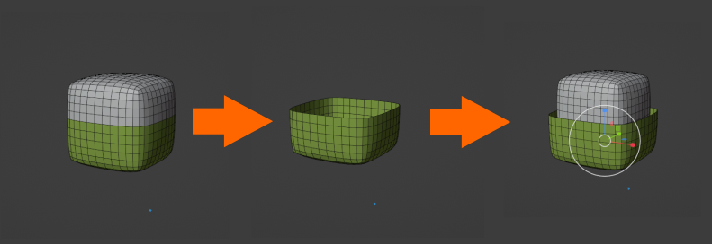
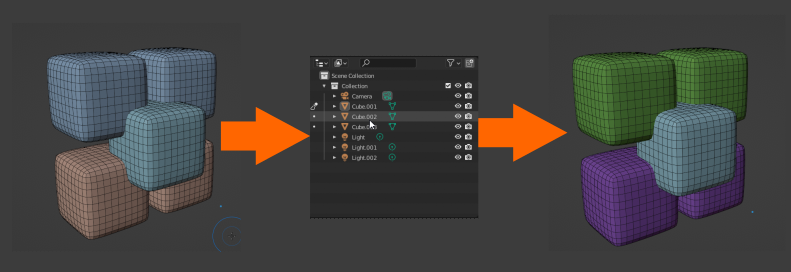
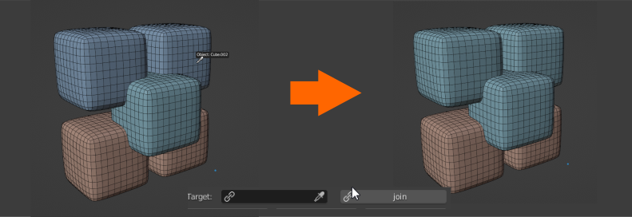

# TpqzSculptTool
Workflow plugin for Blender sculpt mode.

### DEMO :
- https://www.youtube.com/watch?v=7B63X3QTvn4
- https://www.youtube.com/watch?v=X2SYB6l-yyE&t=44s

### Why this plugin
The plugin make it possible to stay in sculpt mode longuer and therefore make the sculpt process more fluid.
It integrates basic operations like : 
- adding/deleting object
- generate sculptable mesh on the fly
- split/join functions
- symmetry

With this plugin you can easily produce modular meshes that can be joined and became a great base for your sculpts.

I hope you will find it usefull.

### ESSENTIAL SHORTCUTS
Make your life easier and create shortcuts for the brushes you are using often :

    - modeling brushes (set for me to alt+ 0-9 )
    - masking (fill, remove mask)
    - object properties->viewport display->wireframe (will be set in the plugin on the next version)
    - transformation brushes (move (set for me to 1), scale (set for me to 2), rotate (set for me to 3))
    - line project, box trim (set for me to 4 & 5 )
    - Face sets
    - colors/ (fill)

A shortcut is created at the plugin installation to alt+X to show the custom menu.

### MANUAL

## MAIN FEATURES
Most of the features are self explanatory, most of them are simple Blender features. This section will focus on the most important features of the plugin.
### Create
***Xtract & Solidify*** : Create a new sculptable mesh  from a mask

***From mask*** : Create a masked object from part of the object

***Xtract faceset*** : Create new faceset from visible faceset

***Duplicate mesh*** : Duplicate current mesh

***Create mesh*** : Generate  cube, sphere, cylinder, torus, cone or plane then automaticaly select transform brush

### Mesh operations
***Mask subdivide*** : Mask a zone on your mesh to subdivise a zone of the mesh

***Spherize*** : Spherize a mesh. Works well with xtract solidify.

### Face sets

***Mask hidden face set*** : Sometime usefull.

### Join

***Join from outliner*** : Join several objets by selecting them in the outliner

***Simple join*** : Join the selected object with the one selected in the select box.

### Boolean operations
Use the object selector and click on the desired opertation to make an Add, a difference or a boolean operation.
***Add***

***Difference***

***Intersect***

